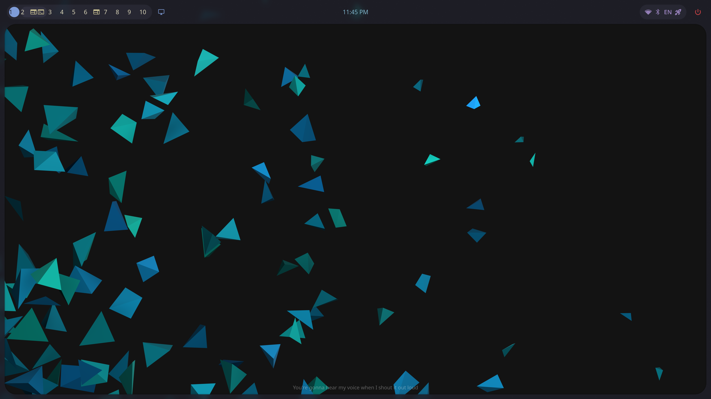
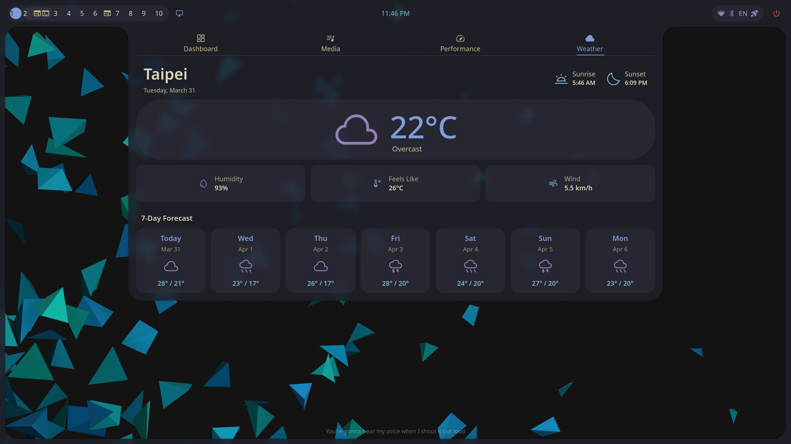
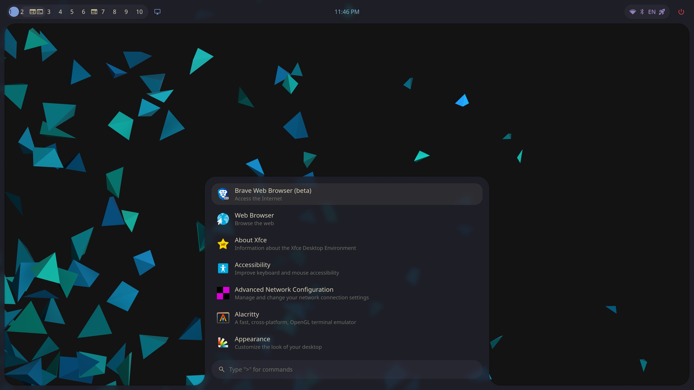
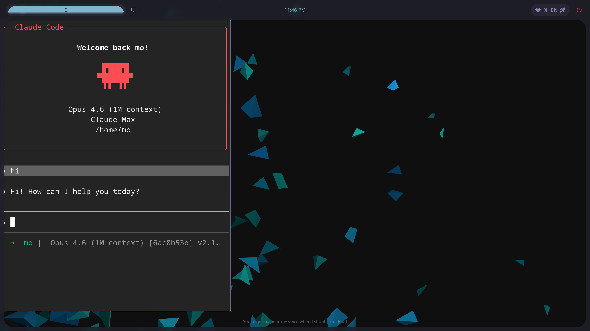
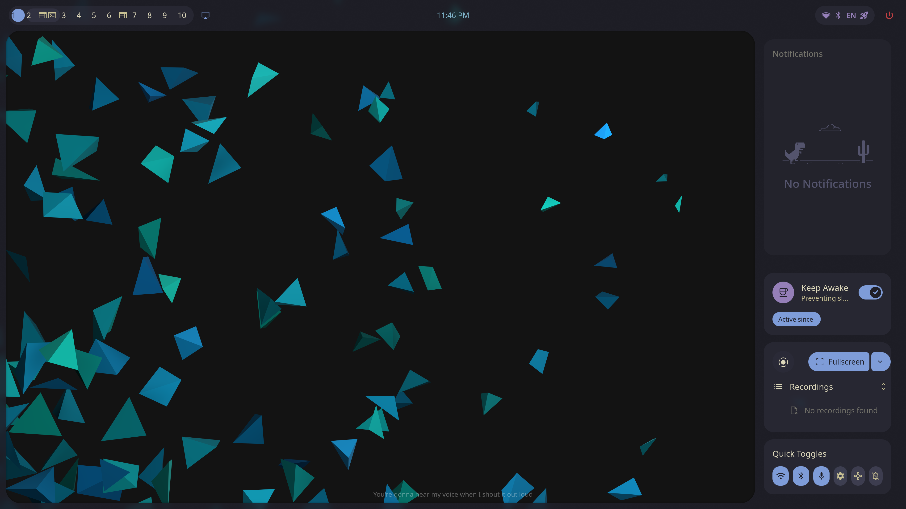
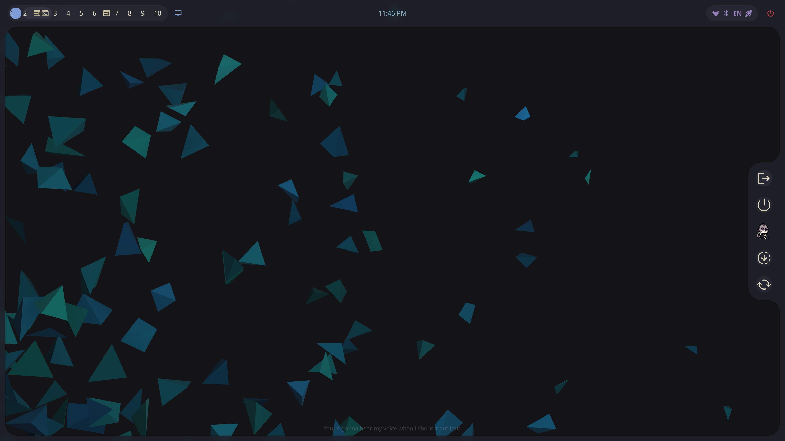

# My dotfiles

Configuration files for Linux (Arch + Hyprland) and WSL, managed with [GNU Stow](https://www.gnu.org/software/stow/).

## Screenshots

### Desktop with Horizontal Bar


### Dashboard (Weather, Calendar, Media, Performance)


### App Launcher


### Claude Code Scratchpad


### Notification Sidebar


### Session Menu


## Quick Start

Deploy configs for your machine with a profile:

```bash
git clone https://github.com/<user>/dotfiles.git ~/.dotfiles
cd ~/.dotfiles

# Pick your machine type
./profiles/home.sh     # 4K desktop
./profiles/laptop.sh   # Laptop
./profiles/wsl.sh      # WSL (work)
```

Or stow individual packages:

```bash
cd ~/.dotfiles
stow <package>       # deploy
stow -D <package>    # remove
```

## Profiles

| Profile | Machine | Packages |
|---------|---------|----------|
| `home.sh` | 4K desktop (Arch + Hyprland) | core, zsh, zsh-personal, starship, tmux, gitconfig, hyprland, mo-vim, udev |
| `laptop.sh` | Laptop (Arch + Hyprland) | core, zsh, zsh-personal, starship, tmux, gitconfig, hyprland, mo-vim, udev |
| `wsl.sh` | WSL (work) | core, wsl, zsh, zsh-personal, starship, tmux, gitconfig, mo-vim |

See [docs/profiles.md](docs/profiles.md) for details.

## Packages

| Package | Description |
|---------|-------------|
| `core` | Shared scripts and utilities (tmux helpers, clipboard, system tools) |
| `wsl` | WSL work environment: AWS/GCP/k8s scripts, mise toolchain, systemd monitor |
| `zsh` | Zsh config with zinit |
| `zsh-personal` | Personal zsh overrides and functions |
| `starship` | Starship prompt |
| `tmux` | Tmux config |
| `gitconfig` | Git config with delta, conditional work includes |
| `hyprland` | Hyprland WM, QuickShell desktop shell, display auto-detection, hypridle, hyprlock |
| `mo-vim` | Neovim config |
| `udev` | Custom udev rules |
| `alacritty` | Alacritty terminal |

See [docs/packages.md](docs/packages.md) for the full list and [docs/wsl-tools.md](docs/wsl-tools.md) for WSL script reference.

## QuickShell Desktop Shell

A unified Material 3 desktop shell built on [Caelestia](https://github.com/caelestia-shell/shell), customized with a horizontal top bar layout and 4K scaling. Replaces waybar, swaync, walker, and wlogout.

### Features

- **Horizontal Bar**: Workspaces (1-10), active window title, centered clock, status icons (audio, network, bluetooth, battery), power button
- **Launcher**: App search with fuzzy matching, calculator, clipboard history, color schemes, wallpaper picker
- **Dashboard**: Weather (7-day forecast), calendar, media controls, system performance (CPU/GPU/RAM/storage/network)
- **Sidebar**: Notification center, screen recording, quick toggles
- **OSD**: Volume/brightness overlay with hover reveal
- **Session**: Power menu (logout, shutdown, reboot, hibernate, lock, suspend)
- **Claude Code**: Hyprland scratchpad with foot terminal running Claude Code, slides from the left
- **Control Center**: Full settings UI for appearance, audio, networking, bluetooth

### Keybinds

| Key | Action |
|-----|--------|
| `Super + Space` | App Launcher |
| `Super + D` | Dashboard |
| `Super + C` | Claude Code (scratchpad) |
| `Super + N` | Notification Sidebar |
| `Super + M` | Session Menu |
| `Super + Shift + A` | Utilities |
| `Super + Shift + ,` | Control Center |

## Display Auto-Detection

Monitors are auto-detected at startup and on hotplug. A profile system maps monitor resolutions to Hyprland config and QuickShell appearance scales — no manual reconfiguration needed when switching between displays.

## Requirements

- git
- [GNU Stow](https://www.gnu.org/software/stow/)
- `$HOME/.config` as XDG config directory
