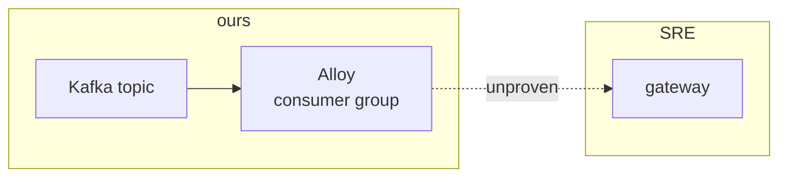

# Draw design

Draw a design into the shared library's **Designs** section — **one page per design** under
`~/teach-me/library/docs/designs/`, sibling of Decisions/Bugs/Plans/Reminders. Diagram
first, prose second. `index.md` holds only the rollup, never bodies. Serve on port 8042
like `/teach-me` and publish to the SIT hub like `/daily`.

The point: a design lives in someone's head as a shape, and prose flattens it. A diagram
puts the whole thing on one screen — but a diagram also makes everything on it look
equally certain, which is how an unproven hop ends up built. So the house rule is
**dashed means unverified**, and every dashed edge owes a row in the verified-vs-assumed
table saying what would settle it.

Pages are **live**: re-running on the same slug rewrites from current reality rather than
appending. The frozen reasoning behind a call belongs in `/adr`.

Not this skill:

- `/adr` — *why* a call was made, numbered, immutable. A design page links to it.
- `/architecture` — investigate a system and *recommend* a shape. Use it to decide; use this to show what was decided.
- `/publish-plan` — stages, gates and rollback. Sequencing, not shape.
- `/teach-me` — teach a topic across many pages. This is one page about one design.

Three verbs: **add** (default), **update \<slug\>** (redraw in place), **list**.

## Step 0 — ensure the library + Designs section exist

```bash
for d in ~/.claude/skills/teach-me ~/work/git/configs/.agents/skills/teach-me; do
  [ -f "$d/scripts/ensure_library.sh" ] && TM="$d" && break
done
[ -n "$TM" ] && bash "$TM/scripts/ensure_library.sh" || echo "install the teach-me skill first"
python3 ~/.claude/skills/draw-design/scripts/ensure_designs.py   # index + nav section (idempotent)
```

Keep `$TM` — its `serve_library.sh` / `publish_sit.sh` / `open_site.sh` are reused below.

## Step 1 — scaffold

```bash
ls ~/teach-me/library/docs/designs/     # redraw an existing slug rather than forking it
python3 ~/.claude/skills/draw-design/scripts/ensure_designs.py new <slug> "<Title>" <YYYY-MM-DD>
```

Title names the shape, not the problem — "Alloy exports through one OTLP gateway", not
"How should Alloy export". Someone scanning the nav should know what was drawn.

## Step 2 — draw it

Pick the form from what the reader has to understand:

| The question | Diagram |
| --- | --- |
| What talks to what, and in which direction | `flowchart LR` |
| What happens in what order, or where a race is | `sequenceDiagram` with `autonumber` |
| What state a thing is in and what moves it | `stateDiagram-v2` |
| Who owns which half of the problem | `flowchart` with one `subgraph` per owner |

One diagram carries the whole design. If it needs more than about a dozen nodes, the main
diagram keeps the spine and each elided part gets its own smaller diagram below — a
diagram nobody can read at a glance is worse than the prose it replaced.

House rules, all of them load-bearing here:

- **Solid edge = it exists today or was measured. Dashed (`-.->`) = designed, unproven.**
  This is the whole discipline. A solid line the reader cannot verify is the failure mode
  this skill exists to prevent.
- **Never set a mermaid theme or hex colour**, and no `%%{init: ...}%%` block. The library
  loads its own `mermaid-local.js` and renders in the reader's light or dark theme; a
  hardcoded fill is invisible in one of them.
- **`subgraph` per owner** when a design crosses a team boundary. Which asks are ours and
  which are somebody else's is usually the most actionable thing on the page.
- Keep labels to a few words; break with `<br/>`. Wrap any label containing brackets,
  quotes or a colon in `["..."]` or mermaid fails to parse.
- Give nodes short stable ids (`kafka`, `alloyA`, `gw`) — the prose below cites them.
- No raw Unicode emoji anywhere on the page; the library's `tools/lint_readability.py`
  gate rejects them. Status uses `:material-*:` shortcodes.



## Step 3 — explain it, succinctly

Prose exists to make the diagram readable, not to restate it. Fill the sections inside
`<!-- design:start -->` … `<!-- design:end -->`:

- **The design** — the diagram. Nothing else in this section.
- **How to read it** — only what the diagram cannot say for itself: what dashed means
  here, what a subgraph boundary is. Three lines, skip it if the diagram is obvious.
- **The flow** — one numbered line per hop, each naming a node id from the diagram, so a
  reader can follow with their eye. Around ten lines. If it needs more, the diagram is
  doing too little.
- **What it changes** — a table of today versus designed, one row per component, citing
  `path:line` wherever the code already exists. This is the row set an implementer works
  from.
- **Verified vs assumed** — every dashed edge appears here with the check that would
  settle it. Same table shape as `/adr`:
  `:material-check-decagram: Verified — <how>` / `:material-help-circle-outline: Assumed — <what would settle it>`.
- **Open questions** — what has to be answered before building, and **who owns each**.
  Split ours from theirs; an unowned question is how a design stalls silently.

Then refresh the index rollup inside `<!-- designs:start/end -->`, alphabetical, one row
each, and its TL;DR count:

```markdown
| [<Title>](<slug>.md) | <Area> | :material-lightbulb-outline: Proposed | 2026-08-07 | <one-line what it draws> |
```

Writing rules the library's gate enforces, so write for them rather than fixing after:
**bold under 10% of prose words** (promote repeat emphasis to a `###` heading instead) and
**table cells at most 25 words** (depth belongs in the sections, not the rollup). Quote
evidence verbatim in its shortest decisive form, and hyperlink every reference — MRs as
`[proj!N](url)`, board items, ADRs, source files at `path:line`.

## Step 4 — build · lint · serve · publish · open

```bash
cd ~/teach-me/library && uv run zensical build                  # fix until clean
python3 tools/lint_readability.py docs/designs/*.md             # separate gate — fix, never baseline
bash "$TM/scripts/serve_library.sh" 8042                        # no-ops if already up
```

A clean build does not mean the page passes; the readability gate is its own run. Then
publish to the SIT hub in the background (never block): `bash "$TM/scripts/publish_sit.sh"`
via Bash with `run_in_background: true`.

```bash
bash "$TM/scripts/open_site.sh" 8042 designs/<slug>/
```

Check the diagram actually rendered before reporting — a mermaid parse error shows as a
raw code block on the page, and `zensical build` stays green through it. Report the URL
`http://127.0.0.1:8042/designs/<slug>/`, the title, and that the SIT copy is refreshing.

## Examples

- `/draw-design` after a design conversation → draws the shape agreed in the thread.
- `/draw-design the Alloy OTLP gateway export path` — one flowchart, ownership subgraphs, the unproven `/otlp` multi-signal hop dashed.
- `/draw-design update alloy-otlp-gateway` — redraws the page from current reality after an answer lands and an edge goes solid.
- `/draw-design list` — prints the designs on record, no rebuild.
